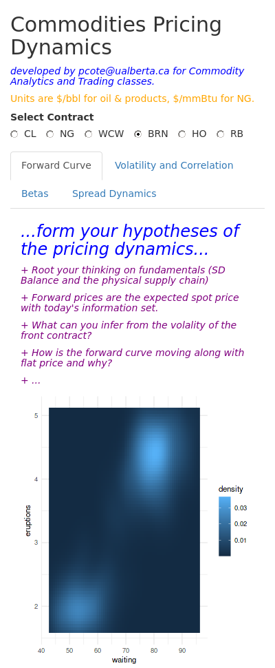

<!-- README.md is generated from README.Rmd. Please edit that file -->
<!-- badges: start -->

[](https://github.com/risktoollib/RTLappDynamics/actions)
[](https://app.codecov.io/gh/risktoollib/RTLappDynamics?branch=master)
<!-- badges: end -->

***Part of a series of Shiny applications to support education of risk
managers and trading analysts in Universities and commodity-trading
enterprise.***

# Goals

This appl

The goal of RTLappDynamics

## Installation

You can install the development version of RTLappDynamics from
[GitHub](https://github.com/) with:

``` r
# install.packages("devtools")
devtools::install_github("risktoollib/RTLappDynamics")
```

## Example

This is a basic example which shows you how to solve a common problem:

``` r
library(RTLappDynamics)
RTLappDynamics::run_app()
#> Loading required package: shiny
#> 
#> Listening on http://127.0.0.1:6340
```



You’ll still need to render `README.Rmd` regularly, to keep `README.md`
up-to-date. `devtools::build_readme()` is handy for this. You could also
use GitHub Actions to re-render `README.Rmd` every time you push. An
example workflow can be found here:
<https://github.com/r-lib/actions/tree/v1/examples>.
